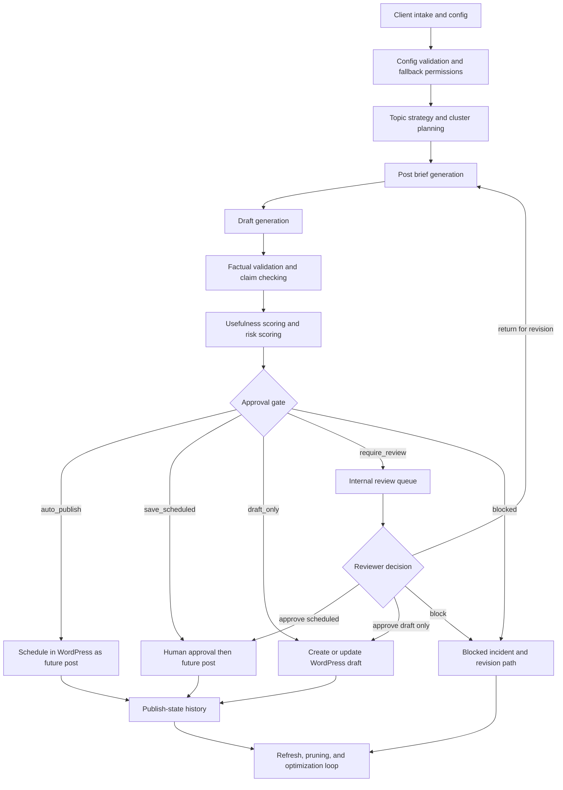

# Workflow Map

## Objective

Map the end-to-end automated blogging workflow from client onboarding through refresh and pruning, including decision states, queues, and manual checkpoints.

## End-to-End Flow

## Stage Map

| Stage | Primary Owner | Trigger | Outputs | Block or Review Conditions |
| --- | --- | --- | --- | --- |
| 1. Intake and config | ops owner | new client or config update | validated config version, completeness score | missing required core fields, invalid WordPress connection |
| 2. Topic strategy and cluster planning | strategy engine | approved config or monthly planning cycle | topic clusters, editorial windows | duplicate cluster, excluded topic, insufficient source coverage |
| 3. Post brief generation | strategy engine | approved topic slot | structured brief with taxonomy hints | prohibited claim path, missing CTA rule, missing internal-link targets where required |
| 4. Draft generation | draft worker | approved brief | draft package | generator attempts prohibited assertions or fails policy constraints |
| 5. Validation and claim checking | validation worker | draft generated | source ledger, claim records, validation result | unsupported claims, prohibited inference, stale required sources |
| 6. Usefulness and risk scoring | scoring worker | validation complete | usefulness score, risk score, reason codes | usefulness below threshold, hard-risk override |
| 7. Approval gating | decision service | scores complete | decision state and review task if needed | risk band above auto-publish threshold, hard override, unsupported content |
| 8. WordPress draft or scheduled publish | publish worker | approved publishable state | WordPress post record, publish-state history | credential failure, taxonomy mismatch, duplicate slug collision |
| 9. Refresh, pruning, and optimization | refresh worker plus operator | age threshold, stale sources, manual notes | refresh candidate, archive recommendation, prune task | policy change, unresolved factual dispute, backlog saturation |

## Queue Design

Primary queues:
- `intake_review`
- `planning_queue`
- `brief_queue`
- `draft_queue`
- `validation_queue`
- `review_queue`
- `publish_queue`
- `refresh_queue`
- `incident_queue`

Queue rules:
- one active processing state per subject record at a time
- blocked items create an incident and a review task
- review-required items cannot transition to publish without explicit approval history
- auto-publish can be paused globally, by vertical, or by client

## Manual Checkpoints

### Checkpoint 1: Intake Review

Purpose:
- confirm fallback permissions
- confirm prohibited and proof-backed claims
- test WordPress connection

### Checkpoint 2: Review Queue

Purpose:
- inspect medium-risk content
- inspect any content with hard overrides
- resolve unsupported or partially supported claims

### Checkpoint 3: Incident Review

Purpose:
- resolve duplicate-topic collisions
- resolve publish failures not fixed by retry
- resolve factual disputes or rollback requests

## Approval State Transitions

Initial states:
- `queued`
- `planning`
- `briefed`
- `drafted`
- `validated`

Decision states:
- `auto_publish`
- `save_scheduled`
- `draft_only`
- `require_review`
- `blocked`

Terminal or follow-up states:
- `scheduled`
- `draft_in_wordpress`
- `published`
- `returned_for_revision`
- `archived`

Transition rules:
- `blocked` requires evidence-backed correction or scope reduction before re-entry
- `require_review` must log a human actor and reason code before leaving review
- `scheduled` stores the selected publish window and cadence rationale
- `published` is imported back into the internal state history from WordPress sync jobs

## Natural Cadence Workflow

1. Compute monthly output target from `cadence_settings`.
2. Create approved publish windows rather than exact dates.
3. Weight windows by seasonality, cluster spacing, and service priority.
4. Exclude windows that create obvious recurring patterns.
5. Assign scheduled posts into the best remaining windows.
6. Re-open windows if review delays cause schedule drift.

## Refresh and Pruning Loop

Refresh triggers:
- source freshness expiry
- platform guidance older than allowed threshold
- outdated CTA or offer
- duplicate or cannibalizing topic cluster
- WordPress draft lingering beyond service-level target

Prune triggers:
- post no longer aligned with current offers
- content cannot be revalidated safely
- duplicate topic superseded by a stronger canonical post

Outputs:
- refresh brief
- prune recommendation
- archive note
- incident record when removal is sensitive
